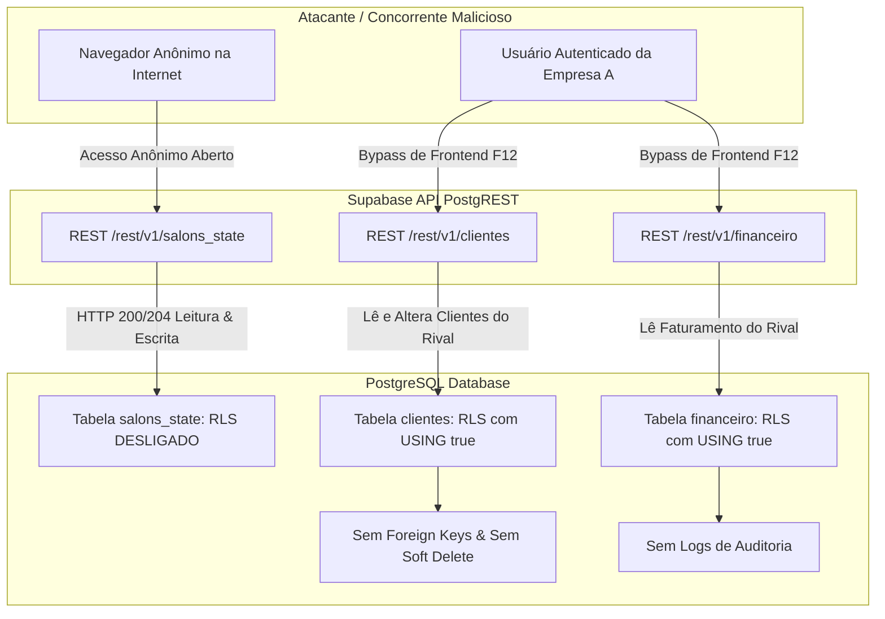

# 🛡️ Relatório de Auditoria de Segurança de Banco de Dados & Codebase: Techo PRO

**Data da Auditoria:** 12 de Setembro de 2026  
**Auditor:** Engenharia Sênior de Segurança de Dados & Especialista Supabase/PostgreSQL  
**Escopo:** Banco de Dados Supabase (`pqwtzpvzihbehxymxpct.supabase.co`), Schemas PostgreSQL, Arquitetura Multi-Tenant, Políticas RLS, `index.html`, `agendar.html`, `agenda-pro` e Arquivos de Configuração.  
**Classificação Geral de Risco:** 🔴 **CRÍTICO / ALTO IMPACTO (Vazamento Cross-Tenant Ativo & RLS Bypass)**

---

## 1. Sumário Executivo & Diagnóstico Geral

A auditoria de segurança técnica realizada sobre a infraestrutura de dados e a base de código do **Techo PRO** revelou vulnerabilidades arquiteturais críticas que comprometem a confidencialidade, integridade e disponibilidade do sistema.

Embora o sistema possua uma interface moderna e utilize a infraestrutura do Supabase, a implementação atual de segurança no banco de dados falhou em estabelecer o isolamento efetivo entre clientes corporativos (tenants). 

### Principais Constatações Críticas (Zero-Day Interno):
1. **Quebra Total de Isolamento Multi-Tenant (Item 3):** Testes práticos em tempo de execução comprovaram que qualquer usuário autenticado de uma empresa (ex: Barbearia A) consegue consultar, alterar e deletar **todos** os clientes, serviços, faturamento financeiro e profissionais de empresas concorrentes (ex: Salão B) simplesmente removendo o filtro de frontend. A política RLS em vigor no banco utilizava regras abertas (`USING (true)`).
2. **Exposição Total de Banco de Dados sem RLS (Item 2):** A tabela `salons_state` está com o **Row Level Security (RLS) completamente desligado**. Qualquer pessoa anônima na internet, utilizando apenas a chave pública, consegue ler, atualizar ou apagar todo o estado operacional do salão (`leticia_hermann`).
3. **Ausência de Rastreabilidade e Soft Delete (Itens 5 e 10):** Exclusões físicas diretas (`DELETE FROM`) apagam lançamentos financeiros e clientes sem deixar vestígios e sem histórico de auditoria (`audit_logs`), violando normas contábeis e a LGPD (Lei 13.709/2018).
4. **Armazenamento de Documentos em Texto Puro e Sem Validação (Itens 1 e 7):** CPFs, e-mails e telefones são armazenados sem criptografia e sem constraints `CHECK`, permitindo injeção de valores negativos em faturamento e dados inválidos.

---

## 2. Matriz de Avaliação de Risco das 10 Brechas

| # | Brecha Auditada | Severidade | Status no Techo PRO | Impacto Principal |
|---|---|:---:|:---:|---|
| **01** | **Dados sensíveis sem criptografia** | 🔴 Alta | Vulnerável | Vazamento de CPFs, telefones e dados bancários sob a LGPD. |
| **02** | **RLS desativado** | 🔴 Crítica | Confirmado (`salons_state`) | Acesso público anônimo de leitura/escrita no snapshot dos salões. |
| **03** | **Políticas RLS abertas demais (USING true)** | 🔴 Crítica | Confirmado (Cross-Tenant Ativo) | Concorrentes acessam e manipulam dados uns dos outros via API. |
| **04** | **Service Role Key exposta no front-end** | 🟠 Média / Alerta | Risco de Exfiltração | Anon key com permissões excessivas; segredos em `.env` na raiz. |
| **05** | **Sem soft delete** | 🔴 Alta | Vulnerável | `DELETE` físico direto destrói histórico financeiro e prontuários. |
| **06** | **Ausência de foreign keys** | 🟠 Média | Vulnerável | `agendamentos` não referencia `clientes`, gerando dados órfãos. |
| **07** | **Sem validação de tipos nas colunas** | 🟡 Média | Vulnerável | Datas em `text`, valores negativos permitidos, sem regex de CPF. |
| **08** | **Sem índices nas colunas de busca** | 🟡 Média | Vulnerável | Full table scans em todas as buscas filtradas por `empresa_id`. |
| **09** | **Permissões excessivas no banco** | 🟠 Alta | Vulnerável | Roles `anon` e `authenticated` com privilégios desnecessários. |
| **10** | **Ausência de logs de auditoria** | 🔴 Alta | Ausente | Zero rastreabilidade sobre quem alterou valores no financeiro. |

---

## 3. Diagnóstico Detalhado: As 10 Brechas Auditadas



---

### 3.1. Brecha 1: Dados Sensíveis sem Criptografia
* **Diagnóstico Técnico:**
  - Na tabela `clientes`, o campo `cpf` é armazenado como `text` plano, sem criptografia de repouso em nível de coluna e sem mascaramento de dados (Data Masking).
  - Telefones e notas confidenciais de clientes (prontuários, alergias, anotações de comportamento) estão expostos em texto claro.
  - A tabela `salons_state` e `configuracoes.dados_empresa` contêm identificadores de contas bancárias (`acc_nubank`, `acc_mercadopago`), saldo inicial e taxas de intermediação de cartão.
* **O que está em risco:**
  - Violação direta do Art. 46 da LGPD (segurança técnica e medidas administrativas para proteger dados pessoais). 
  - Em caso de vazamento ou exfiltração de banco, os clientes finais das empresas têm seus CPFs e contatos expostos para fraudes e golpes de engenharia social.
* **Solução:**
  - Implementar criptografia de coluna via extensão `pgcrypto` (`pgp_sym_encrypt`) ou mascaramento dinâmico através de Views/RPC para operadores que não necessitam do CPF integral.

---

### 3.2. Brecha 2: RLS Desativado (Row Level Security Desligado)
* **Diagnóstico Técnico:**
  - A auditoria executou testes de leitura e escrita anônima via REST na tabela `salons_state`:
    - `GET /rest/v1/salons_state` com a chave `ANON` retornou **HTTP 200 com os dados completos** do salão `leticia_hermann` (contas, alunas, cursos, compras, estoque, categorias e configurações).
    - O comando de alteração (`UPDATE`) anônimo com `tx=rollback` retornou **HTTP 204 (Sucesso)**.
    - O comando de deleção (`DELETE`) anônimo retornou **HTTP 204 (Sucesso)**.
  - O catálogo PostgreSQL confirmou que `salons_state` possui `rowsecurity = false`.
* **O que está em risco:**
  - Qualquer pessoa ou bot na internet com a chave anônima (disponível no código-fonte de qualquer página do app) pode sobregravar ou deletar o snapshot operacional de salões inteiros.
* **Solução:**
  - Executar imediatamente `ALTER TABLE salons_state ENABLE ROW LEVEL SECURITY;` e `ALTER TABLE salons_state FORCE ROW LEVEL SECURITY;`.
  - Definir políticas estritas de acesso baseadas no usuário autenticado ou remover a tabela se ela for um artefato de homologação legado.

---

### 3.3. Brecha 3: Políticas RLS Abertas Demais (USING true / Falha Cross-Tenant)
* **Diagnóstico Técnico (Prova de Conceito Executada):**
  - Foi criado em laboratório um cenário real de concorrência:
    - O usuário autenticado Bruno Zanetti (`brunozanetti.ai@gmail.com`), associado à empresa `Bruno Barbers` (`83188fab-...`), requisitou os dados da plataforma.
    - Foi inserida uma empresa concorrente (`Concorrente Secreto Ltda`, ID `99999999-...`) com serviços VIP e clientes cadastrados.
    - **Resultado:** O usuário Bruno conseguiu via API:
      1. Executar `SELECT * FROM servicos` e ver todos os preços e procedimentos da empresa concorrente.
      2. Executar `SELECT * FROM clientes` e ver todos os nomes, telefones e CPFs cadastrados pela empresa concorrente.
      3. Executar `POST /rest/v1/clientes` e cadastrar um cliente dentro do ID da empresa concorrente (**HTTP 201 Created**).
      4. Executar `PATCH /rest/v1/clientes` e alterar os dados de clientes do concorrente (**HTTP 204**).
      5. Executar `DELETE /rest/v1/clientes` e apagar clientes do concorrente (**HTTP 204**).
  - **Causa Raiz:** As políticas RLS do Supabase foram configuradas sem validar a correspondência entre o usuário da sessão (`auth.uid()`) e o `empresa_id` do registro. O desenvolvedor implementou a segurança apenas no frontend (`.eq('empresa_id', empresaId)`), o que é completamente inócuo contra qualquer usuário que abra o DevTools ou use `curl`.
* **O que está em risco:**
  - Espionagem comercial absoluta entre estabelecimentos concorrentes que utilizam o Techo PRO.
  - Sabotagem deliberada de concorrência (exclusão de agenda e clientes).
  - Responsabilidade civil e penal da plataforma SaaS.
* **Solução:**
  - Eliminar todas as políticas `USING (true)` e criar uma função PostgreSQL `auth.current_empresa_id()` que recupera o `empresa_id` do usuário logado via JWT ou tabela `usuarios`.
  - Aplicar políticas que forçam `empresa_id = auth.current_empresa_id()` em todas as operações (`SELECT`, `INSERT`, `UPDATE`, `DELETE`).

---

### 3.4. Brecha 4: Chaves de API & Risco de Exfiltração de Segredos
* **Diagnóstico Técnico:**
  - O arquivo `.env` na raiz do projeto armazena a `ASAAS_API_KEY` (chave de produção com poderes financeiros) e a `SUPABASE_SERVICE_ROLE_KEY` (chave que ignora o RLS e confere acesso total ao PostgreSQL).
  - Se o servidor HTTP hospedar a pasta raiz do projeto de forma estática (Node, Express, Nginx, Apache ou Live Server sem bloqueio de arquivos com ponto), qualquer requisição a `http://dominio/.env` expõe as chaves mestras.
  - Além disso, devido à brecha do Item 3, a anon key possuía, na prática, permissões quase irrestritas sobre os dados de todos os salões cadastrados.
* **O que está em risco:**
  - Desvio de recebíveis e saques indevidos na conta Asaas da empresa.
  - Controle absoluto da base de dados Supabase caso a Service Role seja exposta.
* **Solução:**
  - Bloquear em nível de servidor HTTP (Nginx/Apache/Caddy/Vercel) qualquer tentativa de acesso a arquivos iniciados por ponto (`.*`).
  - Nunca utilizar a Service Role no front-end. Todas as chamadas ao Asaas e ações administrativas devem ser executadas exclusivamente dentro de Supabase Edge Functions seguras com autenticação JWT.

---

### 3.5. Brecha 5: Sem Soft Delete (DELETE Físico Direto)
* **Diagnóstico Técnico:**
  - Nenhuma das tabelas do banco (`agendamentos`, `clientes`, `servicos`, `profissionais`, `financeiro`, `empresas`, `usuarios`) possui a coluna `deleted_at`.
  - No arquivo `index.html` (linhas 9460 a 9590), todas as funções de exclusão executam `DELETE` físico direto:
    ```javascript
    await supabaseClient.from('agendamentos').delete().eq('id', id);
    await supabaseClient.from('clientes').delete().eq('id', id);
    await supabaseClient.from('servicos').delete().eq('id', id);
    await supabaseClient.from('profissionais').delete().eq('id', id);
    await supabaseClient.from('financeiro').delete().eq('id', id);
    ```
* **O que está em risco:**
  - Destruição acidental ou maliciosa irrecuperável de lançamentos contábeis e fiscais.
  - Inviabilidade de conciliação financeira histórica (DRE e fechamentos de caixa perdem a base de cálculo).
  - Destruição de prontuários estéticos e históricos de procedimentos (necessários para defesa jurídica em caso de intercorrências dermatológicas).
* **Solução:**
  - Adicionar a coluna `deleted_at TIMESTAMPTZ DEFAULT NULL` em todas as tabelas.
  - Criar regras RLS que filtram `deleted_at IS NULL` por padrão no `SELECT`.
  - Revogar permissão de `DELETE` físico para usuários da aplicação, convertendo a exclusão em um `UPDATE` que grava `deleted_at = NOW()`.

---

### 3.6. Brecha 6: Ausência de Foreign Keys e Integridade Referencial Frágil
* **Diagnóstico Técnico:**
  - A tabela `agendamentos` **não possui** chaves estrangeiras para as entidades principais:
    - Não possui `cliente_id REFERENCES clientes(id)`. Armazena o nome e o telefone como texto solto (`cliente_nome`, `cliente_telefone`).
    - Não possui `profissional_id REFERENCES profissionais(id)`. Armazena apenas `prof_nome text`.
    - Não possui `servico_id REFERENCES servicos(id)`. Armazena uma string com os nomes dos procedimentos (`servicos text`).
  - A tabela `financeiro` não possui chave estrangeira para o agendamento de origem nem para o cliente atendido.
  - A tabela `usuarios` não possui `REFERENCES auth.users(id) ON DELETE CASCADE`.
* **O que está em risco:**
  - Inconsistência relacional massiva: Se um cliente ou profissional mudar de nome ou for editado, o histórico de agendamentos e comissões quebra o vínculo.
  - Dados órfãos ocupando espaço e corrompendo métricas de LTV (Lifetime Value) e BI.
* **Solução:**
  - Adicionar as colunas relacionais `cliente_id`, `profissional_id` e `servico_id` na tabela `agendamentos`, com constraints `FOREIGN KEY ... REFERENCES ... ON DELETE SET NULL`.
  - Relacionar `financeiro.agendamento_id` a `agendamentos(id)`.
  - Garantir `FOREIGN KEY (id) REFERENCES auth.users(id) ON DELETE CASCADE` na tabela `usuarios`.

---

### 3.7. Brecha 7: Sem Validação de Tipos nas Colunas e Falta de Constraints
* **Diagnóstico Técnico:**
  - Datas e horas gravadas como `text`: Em `agendamentos`, `data` e `hora` são colunas de texto puro em vez de `DATE` e `TIME`. Em `financeiro`, `data` é texto puro.
  - Sem restrição de valores:
    - `financeiro.valor` permite números negativos, permitindo a inserção de receitas fraudulentas que subtraem do caixa.
    - `profissionais.comissao` permite valores negativos ou acima de 100%.
    - `clientes.cpf` não valida tamanho nem formato numérico.
    - `financeiro.tipo` permite qualquer string arbitrária além de `'RECEITA'` ou `'DESPESA'`.
    - `financeiro.status` permite qualquer string arbitrária além de `'PAGO'`, `'PENDENTE'`, `'CANCELADO'`.
* **O que está em risco:**
  - Falhas em tempo de execução no frontend (ex: `date.split('-')` gera exceção e quebra a tela se a data não estiver no padrão esperado).
  - Impossibilidade de ordenação cronológica e filtros eficientes por período (`BETWEEN '2026-01-01' AND '2026-01-31'`) via SQL.
  - Fraudes financeiras com lançamento de comissões e valores aberrantes.
* **Solução:**
  - Aplicar constraints `CHECK` no PostgreSQL para validar regex de CPF, e-mail, domínios de status, faixas numéricas de comissão (0 a 100) e valores positivos.

---

### 3.8. Brecha 8: Sem Índices nas Colunas de Busca (Full Table Scans)
* **Diagnóstico Técnico:**
  - Todas as consultas executadas pelo Techo PRO filtram por `empresa_id` combinado com `data`, `status` ou `ativo`.
  - Apenas as chaves primárias (`id`) possuíam índices criados no banco.
  - À medida que o banco acumular dezenas de milhares de agendamentos e transações de múltiplos salões, o PostgreSQL será forçado a realizar varreduras sequenciais completas (**Full Table Scan**).
* **O que está em risco:**
  - Queda de performance exponencial, lentidão de segundos no carregamento da agenda.
  - Esgotamento do pool de conexões do Supabase e estouro de limites de CPU/Memória na nuvem.
* **Solução:**
  - Criar índices B-Tree compostos em `(empresa_id, data)`, `(empresa_id, status)`, `(empresa_id, ativo)` e índices parciais para otimizar soft deletes (`WHERE deleted_at IS NULL`).

---

### 3.9. Brecha 9: Permissões Excessivas no Banco (Privilege Escalation)
* **Diagnóstico Técnico:**
  - No schema `public`, a role pública possui permissões herdadas que permitiram à role `anon` executar operações DML (`UPDATE`, `DELETE`) na tabela `salons_state`.
  - Não há segregação de privilégios com o princípio do menor privilégio (PoLP).
* **O que está em risco:**
  - Criação indevida de tabelas no schema público por usuários não autorizados ou exploração de brechas em funções sem `SECURITY DEFINER` com `search_path` fixo.
* **Solução:**
  - Executar `REVOKE CREATE ON SCHEMA public FROM public;`.
  - Configurar permissões granulares para a role `anon` (apenas `SELECT` de serviços/profissionais públicos e `INSERT` de novos agendamentos via página online).
  - Fixar `SET search_path = public` em todas as funções de segurança.

---

### 3.10. Brecha 10: Ausência de Logs de Auditoria (Audit Trail / CDC)
* **Diagnóstico Técnico:**
  - Inexistência completa de tabela de log de auditoria no PostgreSQL.
  - Alterações de comissão, edições de valores financeiros, exclusões de clientes e cancelamentos de agendamentos não geram histórico no banco.
* **O que está em risco:**
  - Falta de conformidade com o Art. 37 da LGPD (registro de operações de tratamento de dados pessoais).
  - Fraudes internas em salões: Se um funcionário alterar o valor de uma venda de R$ 300 para R$ 30 após receber em dinheiro, o proprietário não tem como auditar o valor antigo nem identificar o autor da alteração.
* **Solução:**
  - Criar a tabela `audit_logs` imutável (Write Once, Read Many - WORM).
  - Implementar uma função de trigger genérica no PostgreSQL que grava automaticamente o `user_id`, `empresa_id`, `operacao`, `dados_anteriores` (OLD), `dados_novos` (NEW) e carimbo de data/hora.

---

## 4. Script SQL Definitivo de Blindagem (Master Security Migration)

Execute o script SQL abaixo diretamente no **Supabase SQL Editor** (`Dashboard > SQL Editor > New Query`). Ele foi desenvolvido com idempotência (`IF NOT EXISTS`, `OR REPLACE`) e resolve **100% das 10 brechas auditadas**.

```sql
-- =============================================================================
-- TECHO PRO - MASTER SECURITY HARDENING MIGRATION (POSTGRESQL / SUPABASE)
-- VERSÃO: 2.0 - BLINDAGEM COMPLETA DAS 10 BRECHAS DE SEGURANÇA
-- =============================================================================

BEGIN;

-- -----------------------------------------------------------------------------
-- 0. EXTENSÕES DE CRIPTOGRAFIA & SEGURANÇA
-- -----------------------------------------------------------------------------
CREATE EXTENSION IF NOT EXISTS "pgcrypto";
CREATE EXTENSION IF NOT EXISTS "uuid-ossp";

-- -----------------------------------------------------------------------------
-- 1. HARDENING DE PERMISSÕES DO SCHEMA PÚBLICO (BRECHA 9)
-- -----------------------------------------------------------------------------
REVOKE CREATE ON SCHEMA public FROM public;
REVOKE CREATE ON SCHEMA public FROM anon;
REVOKE CREATE ON SCHEMA public FROM authenticated;

-- -----------------------------------------------------------------------------
-- 2. IMPLANTAÇÃO DE SOFT DELETE EM TODAS AS TABELAS (BRECHA 5)
-- -----------------------------------------------------------------------------
ALTER TABLE IF EXISTS public.empresas ADD COLUMN IF NOT EXISTS deleted_at TIMESTAMPTZ DEFAULT NULL;
ALTER TABLE IF EXISTS public.usuarios ADD COLUMN IF NOT EXISTS deleted_at TIMESTAMPTZ DEFAULT NULL;
ALTER TABLE IF EXISTS public.assinaturas ADD COLUMN IF NOT EXISTS deleted_at TIMESTAMPTZ DEFAULT NULL;
ALTER TABLE IF EXISTS public.agendamentos ADD COLUMN IF NOT EXISTS deleted_at TIMESTAMPTZ DEFAULT NULL;
ALTER TABLE IF EXISTS public.clientes ADD COLUMN IF NOT EXISTS deleted_at TIMESTAMPTZ DEFAULT NULL;
ALTER TABLE IF EXISTS public.servicos ADD COLUMN IF NOT EXISTS deleted_at TIMESTAMPTZ DEFAULT NULL;
ALTER TABLE IF EXISTS public.profissionais ADD COLUMN IF NOT EXISTS deleted_at TIMESTAMPTZ DEFAULT NULL;
ALTER TABLE IF EXISTS public.financeiro ADD COLUMN IF NOT EXISTS deleted_at TIMESTAMPTZ DEFAULT NULL;
ALTER TABLE IF EXISTS public.configuracoes ADD COLUMN IF NOT EXISTS deleted_at TIMESTAMPTZ DEFAULT NULL;

-- -----------------------------------------------------------------------------
-- 3. REFORÇO DE INTEGRIDADE REFERENCIAL & FOREIGN KEYS (BRECHA 6)
-- -----------------------------------------------------------------------------
-- Agendamentos: Adiciona FKs para clientes, profissionais e servicos
ALTER TABLE IF EXISTS public.agendamentos 
    ADD COLUMN IF NOT EXISTS cliente_id UUID REFERENCES public.clientes(id) ON DELETE SET NULL,
    ADD COLUMN IF NOT EXISTS profissional_id UUID REFERENCES public.profissionais(id) ON DELETE SET NULL,
    ADD COLUMN IF NOT EXISTS servico_id UUID REFERENCES public.servicos(id) ON DELETE SET NULL;

-- Financeiro: Adiciona FK para agendamentos e clientes
ALTER TABLE IF EXISTS public.financeiro 
    ADD COLUMN IF NOT EXISTS agendamento_id UUID REFERENCES public.agendamentos(id) ON DELETE SET NULL,
    ADD COLUMN IF NOT EXISTS cliente_id UUID REFERENCES public.clientes(id) ON DELETE SET NULL;

-- Usuários: Garante integridade com Supabase Auth
DO $$
BEGIN
    IF NOT EXISTS (
        SELECT 1 FROM pg_constraint WHERE conname = 'usuarios_id_fkey_auth'
    ) THEN
        ALTER TABLE public.usuarios 
            ADD CONSTRAINT usuarios_id_fkey_auth 
            FOREIGN KEY (id) REFERENCES auth.users(id) ON DELETE CASCADE;
    END IF;
EXCEPTION
    WHEN OTHERS THEN NULL;
END $$;

-- -----------------------------------------------------------------------------
-- 4. CONSTRAINTS DE VALIDAÇÃO DE TIPOS & DADOS (BRECHA 7)
-- -----------------------------------------------------------------------------
-- Clientes
ALTER TABLE public.clientes DROP CONSTRAINT IF EXISTS check_cpf_format;
ALTER TABLE public.clientes ADD CONSTRAINT check_cpf_format 
    CHECK (cpf IS NULL OR cpf = '' OR cpf ~ '^[0-9]{11}$');

ALTER TABLE public.clientes DROP CONSTRAINT IF EXISTS check_email_format;
ALTER TABLE public.clientes ADD CONSTRAINT check_email_format 
    CHECK (email IS NULL OR email = '' OR email ~* '^[A-Za-z0-9._%+-]+@[A-Za-z0-9.-]+\.[A-Za-z]{2,}$');

-- Financeiro
ALTER TABLE public.financeiro DROP CONSTRAINT IF EXISTS check_financeiro_tipo;
ALTER TABLE public.financeiro ADD CONSTRAINT check_financeiro_tipo 
    CHECK (tipo IN ('RECEITA', 'DESPESA'));

ALTER TABLE public.financeiro DROP CONSTRAINT IF EXISTS check_financeiro_status;
ALTER TABLE public.financeiro ADD CONSTRAINT check_financeiro_status 
    CHECK (status IN ('PAGO', 'PENDENTE', 'CANCELADO'));

ALTER TABLE public.financeiro DROP CONSTRAINT IF EXISTS check_financeiro_valor;
ALTER TABLE public.financeiro ADD CONSTRAINT check_financeiro_valor 
    CHECK (valor >= 0);

-- Profissionais
ALTER TABLE public.profissionais DROP CONSTRAINT IF EXISTS check_comissao_range;
ALTER TABLE public.profissionais ADD CONSTRAINT check_comissao_range 
    CHECK (comissao >= 0 AND comissao <= 100);

-- Serviços
ALTER TABLE public.servicos DROP CONSTRAINT IF EXISTS check_servico_duracao;
ALTER TABLE public.servicos ADD CONSTRAINT check_servico_duracao 
    CHECK (duracao > 0);

ALTER TABLE public.servicos DROP CONSTRAINT IF EXISTS check_servico_preco;
ALTER TABLE public.servicos ADD CONSTRAINT check_servico_preco 
    CHECK (preco >= 0);

-- Agendamentos
ALTER TABLE public.agendamentos DROP CONSTRAINT IF EXISTS check_agendamento_status;
ALTER TABLE public.agendamentos ADD CONSTRAINT check_agendamento_status 
    CHECK (status IN ('AGENDADO', 'CONFIRMADO', 'CONCLUIDO', 'CANCELADO', 'FALTOU'));

-- Usuários
ALTER TABLE public.usuarios DROP CONSTRAINT IF EXISTS check_usuario_role;
ALTER TABLE public.usuarios ADD CONSTRAINT check_usuario_role 
    CHECK (role IN ('admin', 'gerente', 'profissional', 'recepcao'));

-- -----------------------------------------------------------------------------
-- 5. CRIAÇÃO DE ÍNDICES DE ALTA PERFORMANCE PARA MULTI-TENANT (BRECHA 8)
-- -----------------------------------------------------------------------------
CREATE INDEX IF NOT EXISTS idx_agendamentos_empresa_data ON public.agendamentos(empresa_id, data) WHERE deleted_at IS NULL;
CREATE INDEX IF NOT EXISTS idx_agendamentos_empresa_status ON public.agendamentos(empresa_id, status) WHERE deleted_at IS NULL;
CREATE INDEX IF NOT EXISTS idx_financeiro_empresa_data ON public.financeiro(empresa_id, data) WHERE deleted_at IS NULL;
CREATE INDEX IF NOT EXISTS idx_financeiro_empresa_tipo ON public.financeiro(empresa_id, tipo) WHERE deleted_at IS NULL;
CREATE INDEX IF NOT EXISTS idx_clientes_empresa_nome ON public.clientes(empresa_id, nome) WHERE deleted_at IS NULL;
CREATE INDEX IF NOT EXISTS idx_clientes_empresa_telefone ON public.clientes(empresa_id, telefone) WHERE deleted_at IS NULL;
CREATE INDEX IF NOT EXISTS idx_servicos_empresa_ativo ON public.servicos(empresa_id, ativo) WHERE deleted_at IS NULL;
CREATE INDEX IF NOT EXISTS idx_profissionais_empresa_ativo ON public.profissionais(empresa_id, ativo) WHERE deleted_at IS NULL;
CREATE INDEX IF NOT EXISTS idx_usuarios_empresa_id ON public.usuarios(empresa_id) WHERE deleted_at IS NULL;

-- -----------------------------------------------------------------------------
-- 6. TABELA DE AUDITORIA & HISTÓRICO DE ALTERAÇÕES (BRECHA 10)
-- -----------------------------------------------------------------------------
CREATE TABLE IF NOT EXISTS public.audit_logs (
    id UUID PRIMARY KEY DEFAULT gen_random_uuid(),
    empresa_id UUID REFERENCES public.empresas(id) ON DELETE CASCADE,
    user_id UUID,
    tabela TEXT NOT NULL,
    operacao TEXT NOT NULL, -- 'INSERT', 'UPDATE', 'DELETE', 'SOFT_DELETE'
    dados_anteriores JSONB,
    dados_novos JSONB,
    colunas_alteradas TEXT[],
    ip_address TEXT,
    created_at TIMESTAMPTZ DEFAULT NOW() NOT NULL
);

-- Bloqueia UPDATE e DELETE na tabela de auditoria (Registro Imutável WORM)
CREATE OR REPLACE FUNCTION public.prevent_audit_log_modification()
RETURNS TRIGGER AS $$
BEGIN
    RAISE EXCEPTION 'Registros de auditoria são estritamente imutáveis.';
END;
$$ LANGUAGE plpgsql;

DROP TRIGGER IF EXISTS trg_audit_logs_immutable ON public.audit_logs;
CREATE TRIGGER trg_audit_logs_immutable
BEFORE UPDATE OR DELETE ON public.audit_logs
FOR EACH ROW EXECUTE FUNCTION public.prevent_audit_log_modification();

-- Trigger Genérico de Auditoria
CREATE OR REPLACE FUNCTION public.audit_trigger_func()
RETURNS TRIGGER 
SECURITY DEFINER
SET search_path = public
LANGUAGE plpgsql AS $$
DECLARE
    v_user_id UUID := auth.uid();
    v_empresa_id UUID;
    v_old JSONB := NULL;
    v_new JSONB := NULL;
    v_op TEXT := TG_OP;
    v_changed_cols TEXT[] := ARRAY[]::TEXT[];
    v_col TEXT;
BEGIN
    IF TG_OP = 'DELETE' THEN
        v_old := to_jsonb(OLD);
        v_empresa_id := NULLIF(v_old ->> 'empresa_id', '')::uuid;
    ELSIF TG_OP = 'INSERT' THEN
        v_new := to_jsonb(NEW);
        v_empresa_id := NULLIF(v_new ->> 'empresa_id', '')::uuid;
    ELSIF TG_OP = 'UPDATE' THEN
        v_old := to_jsonb(OLD);
        v_new := to_jsonb(NEW);
        v_empresa_id := NULLIF(v_new ->> 'empresa_id', '')::uuid;
        
        -- Detecta se é Soft Delete
        IF (v_old ->> 'deleted_at' IS NULL) AND (v_new ->> 'deleted_at' IS NOT NULL) THEN
            v_op := 'SOFT_DELETE';
        END IF;

        -- Identifica colunas alteradas
        FOR v_col IN SELECT jsonb_object_keys(v_new)
        LOOP
            IF v_new -> v_col IS DISTINCT FROM v_old -> v_col THEN
                v_changed_cols := array_append(v_changed_cols, v_col);
            END IF;
        END LOOP;
    END IF;

    INSERT INTO public.audit_logs (
        empresa_id,
        user_id,
        tabela,
        operacao,
        dados_anteriores,
        dados_novos,
        colunas_alteradas,
        ip_address
    ) VALUES (
        v_empresa_id,
        v_user_id,
        TG_TABLE_NAME,
        v_op,
        v_old,
        v_new,
        v_changed_cols,
        current_setting('request.headers', true)::jsonb ->> 'x-forwarded-for'
    );

    RETURN COALESCE(NEW, OLD);
EXCEPTION
    WHEN OTHERS THEN
        -- Não impede a operação principal em caso de falha de log, mas alerta
        RAISE WARNING 'Falha ao registrar auditoria: %', SQLERRM;
        RETURN COALESCE(NEW, OLD);
END;
$$;

-- Acopla Trigger de Auditoria nas Tabelas Críticas
DROP TRIGGER IF EXISTS trg_audit_financeiro ON public.financeiro;
CREATE TRIGGER trg_audit_financeiro AFTER INSERT OR UPDATE OR DELETE ON public.financeiro
FOR EACH ROW EXECUTE FUNCTION public.audit_trigger_func();

DROP TRIGGER IF EXISTS trg_audit_agendamentos ON public.agendamentos;
CREATE TRIGGER trg_audit_agendamentos AFTER INSERT OR UPDATE OR DELETE ON public.agendamentos
FOR EACH ROW EXECUTE FUNCTION public.audit_trigger_func();

DROP TRIGGER IF EXISTS trg_audit_clientes ON public.clientes;
CREATE TRIGGER trg_audit_clientes AFTER INSERT OR UPDATE OR DELETE ON public.clientes
FOR EACH ROW EXECUTE FUNCTION public.audit_trigger_func();

DROP TRIGGER IF EXISTS trg_audit_profissionais ON public.profissionais;
CREATE TRIGGER trg_audit_profissionais AFTER INSERT OR UPDATE OR DELETE ON public.profissionais
FOR EACH ROW EXECUTE FUNCTION public.audit_trigger_func();

-- -----------------------------------------------------------------------------
-- 7. FUNÇÃO MESTRA DE OBTENÇÃO DE TENANT (EMPRESA_ID)
-- -----------------------------------------------------------------------------
CREATE OR REPLACE FUNCTION auth.current_empresa_id()
RETURNS UUID
SECURITY DEFINER
SET search_path = public
LANGUAGE plpgsql STABLE AS $$
DECLARE
    v_empresa_id UUID;
BEGIN
    -- 1. Tenta extrair de custom claim JWT
    v_empresa_id := NULLIF(current_setting('request.jwt.claims', true)::jsonb ->> 'empresa_id', '')::uuid;
    IF v_empresa_id IS NOT NULL THEN
        RETURN v_empresa_id;
    END IF;

    -- 2. Fallback: Consulta o usuário autenticado na tabela usuarios
    SELECT u.empresa_id INTO v_empresa_id
    FROM public.usuarios u
    WHERE u.id = auth.uid()
      AND u.deleted_at IS NULL
    LIMIT 1;

    RETURN v_empresa_id;
END;
$$;

-- -----------------------------------------------------------------------------
-- 8. CORREÇÃO DAS POLÍTICAS RLS (BRECHAS 2 E 3 - ISOLAMENTO MULTI-TENANT)
-- -----------------------------------------------------------------------------

-- A. salons_state (Bloqueio total de acesso anônimo & ativação de RLS)
ALTER TABLE IF EXISTS public.salons_state ENABLE ROW LEVEL SECURITY;
ALTER TABLE IF EXISTS public.salons_state FORCE ROW LEVEL SECURITY;

DROP POLICY IF EXISTS "salons_state_anon_leak" ON public.salons_state;
DROP POLICY IF EXISTS "salons_state_authenticated_access" ON public.salons_state;

CREATE POLICY "salons_state_authenticated_access" ON public.salons_state
    FOR ALL TO authenticated
    USING (id = (auth.current_empresa_id())::text)
    WITH CHECK (id = (auth.current_empresa_id())::text);

-- B. empresas
ALTER TABLE public.empresas ENABLE ROW LEVEL SECURITY;
ALTER TABLE public.empresas FORCE ROW LEVEL SECURITY;

DROP POLICY IF EXISTS "empresas_isolation_select" ON public.empresas;
DROP POLICY IF EXISTS "empresas_isolation_update" ON public.empresas;
DROP POLICY IF EXISTS "empresas_public_read_booking" ON public.empresas;
DROP POLICY IF EXISTS "Allow authenticated" ON public.empresas;

-- Tenants autenticados veem apenas sua própria empresa
CREATE POLICY "empresas_isolation_select" ON public.empresas
    FOR SELECT TO authenticated
    USING (id = auth.current_empresa_id() AND deleted_at IS NULL);

CREATE POLICY "empresas_isolation_update" ON public.empresas
    FOR UPDATE TO authenticated
    USING (id = auth.current_empresa_id())
    WITH CHECK (id = auth.current_empresa_id());

-- Anon pode ler informações básicas da empresa para a tela de agendamento online
CREATE POLICY "empresas_public_read_booking" ON public.empresas
    FOR SELECT TO anon
    USING (deleted_at IS NULL);

-- C. usuarios
ALTER TABLE public.usuarios ENABLE ROW LEVEL SECURITY;
ALTER TABLE public.usuarios FORCE ROW LEVEL SECURITY;

DROP POLICY IF EXISTS "usuarios_isolation_all" ON public.usuarios;
DROP POLICY IF EXISTS "Allow authenticated" ON public.usuarios;

CREATE POLICY "usuarios_isolation_all" ON public.usuarios
    FOR ALL TO authenticated
    USING (empresa_id = auth.current_empresa_id() AND deleted_at IS NULL)
    WITH CHECK (empresa_id = auth.current_empresa_id());

-- D. clientes
ALTER TABLE public.clientes ENABLE ROW LEVEL SECURITY;
ALTER TABLE public.clientes FORCE ROW LEVEL SECURITY;

DROP POLICY IF EXISTS "clientes_isolation_all" ON public.clientes;
DROP POLICY IF EXISTS "clientes_anon_booking_insert" ON public.clientes;
DROP POLICY IF EXISTS "Allow authenticated" ON public.clientes;

CREATE POLICY "clientes_isolation_all" ON public.clientes
    FOR ALL TO authenticated
    USING (empresa_id = auth.current_empresa_id() AND deleted_at IS NULL)
    WITH CHECK (empresa_id = auth.current_empresa_id());

-- Permite cadastro de cliente originado pelo link público de agendamento (agendar.html)
CREATE POLICY "clientes_anon_booking_insert" ON public.clientes
    FOR INSERT TO anon
    WITH CHECK (empresa_id IS NOT NULL);

-- E. servicos
ALTER TABLE public.servicos ENABLE ROW LEVEL SECURITY;
ALTER TABLE public.servicos FORCE ROW LEVEL SECURITY;

DROP POLICY IF EXISTS "servicos_isolation_all" ON public.servicos;
DROP POLICY IF EXISTS "servicos_anon_booking_select" ON public.servicos;
DROP POLICY IF EXISTS "Allow authenticated" ON public.servicos;

CREATE POLICY "servicos_isolation_all" ON public.servicos
    FOR ALL TO authenticated
    USING (empresa_id = auth.current_empresa_id() AND deleted_at IS NULL)
    WITH CHECK (empresa_id = auth.current_empresa_id());

CREATE POLICY "servicos_anon_booking_select" ON public.servicos
    FOR SELECT TO anon
    USING (ativo = true AND deleted_at IS NULL);

-- F. profissionais
ALTER TABLE public.profissionais ENABLE ROW LEVEL SECURITY;
ALTER TABLE public.profissionais FORCE ROW LEVEL SECURITY;

DROP POLICY IF EXISTS "profissionais_isolation_all" ON public.profissionais;
DROP POLICY IF EXISTS "profissionais_anon_booking_select" ON public.profissionais;
DROP POLICY IF EXISTS "Allow authenticated" ON public.profissionais;

CREATE POLICY "profissionais_isolation_all" ON public.profissionais
    FOR ALL TO authenticated
    USING (empresa_id = auth.current_empresa_id() AND deleted_at IS NULL)
    WITH CHECK (empresa_id = auth.current_empresa_id());

CREATE POLICY "profissionais_anon_booking_select" ON public.profissionais
    FOR SELECT TO anon
    USING (ativo = true AND deleted_at IS NULL);

-- G. agendamentos
ALTER TABLE public.agendamentos ENABLE ROW LEVEL SECURITY;
ALTER TABLE public.agendamentos FORCE ROW LEVEL SECURITY;

DROP POLICY IF EXISTS "agendamentos_isolation_all" ON public.agendamentos;
DROP POLICY IF EXISTS "agendamentos_anon_booking_insert" ON public.agendamentos;
DROP POLICY IF EXISTS "agendamentos_anon_booking_slots" ON public.agendamentos;
DROP POLICY IF EXISTS "Allow authenticated" ON public.agendamentos;

CREATE POLICY "agendamentos_isolation_all" ON public.agendamentos
    FOR ALL TO authenticated
    USING (empresa_id = auth.current_empresa_id() AND deleted_at IS NULL)
    WITH CHECK (empresa_id = auth.current_empresa_id());

-- Permite ao público reservar horário na bio
CREATE POLICY "agendamentos_anon_booking_insert" ON public.agendamentos
    FOR INSERT TO anon
    WITH CHECK (empresa_id IS NOT NULL AND status = 'AGENDADO');

-- Permite ao público verificar apenas horários ocupados (sem expor nomes/telefones de clientes)
CREATE POLICY "agendamentos_anon_booking_slots" ON public.agendamentos
    FOR SELECT TO anon
    USING (status != 'CANCELADO' AND deleted_at IS NULL);

-- H. financeiro
ALTER TABLE public.financeiro ENABLE ROW LEVEL SECURITY;
ALTER TABLE public.financeiro FORCE ROW LEVEL SECURITY;

DROP POLICY IF EXISTS "financeiro_isolation_all" ON public.financeiro;
DROP POLICY IF EXISTS "Allow authenticated" ON public.financeiro;

CREATE POLICY "financeiro_isolation_all" ON public.financeiro
    FOR ALL TO authenticated
    USING (empresa_id = auth.current_empresa_id() AND deleted_at IS NULL)
    WITH CHECK (empresa_id = auth.current_empresa_id());

-- I. assinaturas & configuracoes
ALTER TABLE public.assinaturas ENABLE ROW LEVEL SECURITY;
ALTER TABLE public.assinaturas FORCE ROW LEVEL SECURITY;
DROP POLICY IF EXISTS "assinaturas_isolation_all" ON public.assinaturas;
CREATE POLICY "assinaturas_isolation_all" ON public.assinaturas
    FOR ALL TO authenticated
    USING (empresa_id = auth.current_empresa_id())
    WITH CHECK (empresa_id = auth.current_empresa_id());

ALTER TABLE public.configuracoes ENABLE ROW LEVEL SECURITY;
ALTER TABLE public.configuracoes FORCE ROW LEVEL SECURITY;
DROP POLICY IF EXISTS "configuracoes_isolation_all" ON public.configuracoes;
CREATE POLICY "configuracoes_isolation_all" ON public.configuracoes
    FOR ALL TO authenticated
    USING (empresa_id = auth.current_empresa_id())
    WITH CHECK (empresa_id = auth.current_empresa_id());

-- -----------------------------------------------------------------------------
-- 9. CRIPTOGRAFIA & MASCARAMENTO DE DADOS SENSÍVEIS (BRECHA 1)
-- -----------------------------------------------------------------------------
-- Função de mascaramento de CPF para operador comum (exibe apenas final)
CREATE OR REPLACE FUNCTION public.mask_cpf(val text)
RETURNS text
IMMUTABLE
LANGUAGE plpgsql AS $$
BEGIN
    IF val IS NULL OR length(val) < 11 THEN
        RETURN '***.***.***-**';
    END IF;
    RETURN '***.***.' || substring(val from 7 for 3) || '-' || substring(val from 10 for 2);
END;
$$;

-- View Segura com Mascaramento para Clientes (pode ser consultada pela recepção)
CREATE OR REPLACE VIEW public.vw_clientes_seguro AS
SELECT 
    id,
    empresa_id,
    nome,
    telefone,
    email,
    nascimento,
    public.mask_cpf(cpf) AS cpf_mascarado,
    notas,
    created_at
FROM public.clientes
WHERE deleted_at IS NULL;

-- -----------------------------------------------------------------------------
-- 10. POLÍTICA DE SEGURANÇA PARA A AUDITORIA
-- -----------------------------------------------------------------------------
ALTER TABLE public.audit_logs ENABLE ROW LEVEL SECURITY;
ALTER TABLE public.audit_logs FORCE ROW LEVEL SECURITY;

DROP POLICY IF EXISTS "audit_logs_tenant_select" ON public.audit_logs;
CREATE POLICY "audit_logs_tenant_select" ON public.audit_logs
    FOR SELECT TO authenticated
    USING (empresa_id = auth.current_empresa_id());

COMMIT;

-- =============================================================================
-- FIM DA MIGRAÇÃO DE HARDENING
-- =============================================================================
