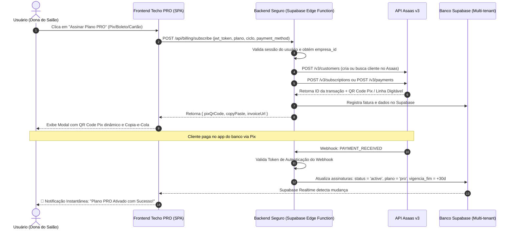

# 📋 Relatório de Auditoria Técnica e Conferência Geral: Techo PRO

**Data da Auditoria:** 11 de Setembro de 2026  
**Auditor:** Auditoria Sênior de Produtos SaaS & Arquitetura de Software  
**Escopo do Sistema:** Código-fonte Techo PRO (`index.html`, `landing.html`, `agenda-pro`, integrações Supabase e infraestrutura de dados).  
**Classificação do Diagnóstico:** **Beta Avançado / MVP Funcional com Bloqueadores Comerciais Críticos**.

---

## 1. Sumário Executivo & Diagnóstico de Maturidade

O **Techo PRO** apresenta uma base de interface (UI) notavelmente bonita, ágil e rica em recursos voltados para estúdios de beleza, manicures, clínicas de estética e barbearias. A transição de temas (*Emerald, Bourbon, Rose Gold*) e os componentes de design system trazem uma percepção de valor superior aos concorrentes legados.

Entretanto, uma auditoria rigorosa de código revelou **três divisores críticos** que separam o estágio atual de um produto SaaS pronto para comercialização em escala:

1. **Assinaturas e Checkout (Asaas):** O botão de upgrade de planos é 100% estático — atualmente apenas abre um link do WhatsApp para um número fictício (`5551999999999`). Não existe geração de Pix Copia e Cola, nem emissão de boleto, nem captura de cartão de crédito recorrente integrada.
2. **Arquitetura de Dados Bipolar (Supabase vs. LocalStorage):** Existe autenticação multi-tenant via Supabase, mas **apenas 5 tabelas** são sincronizadas na nuvem (`agendamentos`, `clientes`, `servicos`, `profissionais`, `financeiro`). Todo o restante (Anamnese, Cursos, Estoque, Fornecedores, Compras, Fechamentos de Caixa, Categorias e Contas) fica salvo exclusivamente no `localStorage` do navegador daquele aparelho específico, impedindo uso simultâneo entre recepcionista no PC e profissional no celular.
3. **Módulos Fictícios/Simulados:** A emissão de **NFS-e** é puramente uma simulação gráfica no navegador (sem conexão com SEFAZ ou prefeituras), e diversas telas de configuração (SMS, WhatsApp, Alterar Senha, Meu Plano) possuem apenas funções vazias (`EMPTY/STUB`) ou alertas estáticos com `alert()`. Além disso, o arquivo `landing.html` no repositório é um template conceitual em inglês de IA e não uma página de vendas do produto.

---

## 2. Raio-X Detalhado: Módulo por Módulo

Abaixo está o inventário de conformidade funcional de cada tela e fluxo do Techo PRO:

| Módulo / Aba | Status Funcional | O que está 100% Pronto | O que está Vazio, Simulado ou Incompleto |
| :--- | :---: | :--- | :--- |
| **Dashboard (BI)** | 🟢 95% | Gráficos Chart.js, indicadores de faturamento, ocupação, ticket médio e aniversariantes do mês. | Projeções futuras dependem de volume de dados na nuvem; métricas de compras ainda não somam no DRE central. |
| **Agenda & Grade** | 🟡 80% | Visualização Diária, Semanal e Lista; mini-calendário funcional; Quick Booking; alteração de status com cores dinâmicas; filtro por profissional. | No mobile, as grades diária (`min-w-[500px]`) e semanal (`min-w-[850px]`) forçam rolagem horizontal desconfortável. Falta sincronização em tempo real (Supabase Realtime) quando múltiplos atendentes agendam ao mesmo tempo. |
| **Clientes & Prontuários** | 🟢 90% | CRUD completo de clientes, cálculo de retorno vencido, filtro VIP/Aluna, histórico de agendamentos, sincronização Supabase. | Falta galeria de fotos de evolução (antes e depois do procedimento) e campo formal de CPF/Endereço para emissão fiscal. |
| **Profissionais & Equipe** | 🟢 95% | CRUD com definição de cor na grade, telefone, percentual de comissão e validação de limite (máx. 1 para plano Starter). | Split automático de repasse bancário e controle de jornada/escala de folga ainda não implementados. |
| **Caixa & PDV** | 🟡 75% | Adição de serviços/produtos, seleção de cliente com datalist, divisão de pagamento, impressão visual de comprovante. | Vendas finalizadas geram receita no financeiro, mas **fechamentos de caixa auditados (`zp_caixas_fechados`) e sangrias ficam apenas no `localStorage`**, sem persistência no Supabase. |
| **Financeiro (Lançamentos)** | 🟢 90% | Entradas e saídas, filtros por categoria/conta/tipo, sincronização no Supabase (`financeiro`). | Conciliação bancária via OFX é apenas um leitor de texto básico que gera lançamentos locais sem deduplicação bancária. |
| **DRE (Demonstrativo)** | 🟡 70% | Exibição de Receita Bruta, Deduções, Custos Operacionais e Lucro Líquido baseado em `state.financial`. | Não inclui apropriação de CMV (Custo de Mercadoria Vendida do estoque) e nem comissões pendentes de pagamento. |
| **Meus Caixas / Fechamento** | 🔴 50% | Interface de conferência cega (dinheiro, pix, cartões) e cálculo de diferença de gaveta. | Não sincroniza na nuvem. Se o caixa for fechado no balcão, a proprietária não consegue ver o relatório fechado no smartphone dela. |
| **Contas, Categorias & Pagamentos** | 🟡 65% | Telas completas para gerenciar bancos, categorias e bandeiras. | Dados vivem exclusivamente em chaves `zp_accounts`, `zp_categories`, `zp_payment_methods` no navegador. |
| **Análise Anual & Mensal** | 🟢 85% | Tabelas expansíveis mês a mês e cálculos dinâmicos de faturamento. | Depende 100% de o financeiro ser lançado à risca; sem automação de provisão de despesas fixas. |
| **Compras & Fornecedores** | 🟡 60% | Cadastro de fornecedores com link direto para cotação no WhatsApp, tabela de pedidos. | Importação de XML é uma simulação de parse simples (não valida chave de 44 dígitos da SEFAZ nem dá entrada automática fracionada no estoque). Persistência 100% local. |
| **Cadastros Gerais (Anamnese, Salas, Marcas, etc.)** | 🟡 60% | Questionários de anamnese, equipamentos, salas, feriados e motivos de contato. | **Falta o Canvas Touch de Assinatura** (que existe no `agenda-pro`, mas não no `index.html`). Todas as respostas de anamnese ficam no `localStorage`. |
| **Consultas (14 Relatórios)** | 🟢 80% | Relatórios de comissões, demonstrativo, auditoria de agendamentos, vendas por cliente e previsão de retorno. | Se a conta for nova, várias telas dependem de histórico massivo. Algumas consultas são estáticas se o profissional não alimentar lançamentos diários. |
| **Cursos & Alunas** | 🟡 60% | Cadastro de cursos (carga horária, valor, alunas matriculadas, controle de pagamento). | Dados em `zp_cursos` e `zp_alunas` (sem Supabase). Falta geração de certificado em PDF e controle de frequência. |
| **Estoque & Insumos** | 🟡 65% | Controle de quantidade, estoque mínimo, alertas visuais de reposição. | Não há baixa automática de insumo por procedimento realizado (ex: 20g de gel por manutenção) nem persistência na nuvem. |
| **NFS-e (Nota Fiscal)** | 🔴 20% | Visualizador de DANFSE idêntico ao modelo nacional e exportação de arquivo XML formatado. | **Totalmente simulado**. Não há certificado digital A1 (.pfx), nem integração com webservice de prefeituras ou integrador fiscal (Focus NFe/PlugNotas). |
| **Config: Meu Plano** | 🔴 25% | UI com comparativo entre planos Starter e PRO, seletor de ciclo (Mensal/Semestral/Anual). | **Função JS vazia (`EMPTY/STUB`)**. Botão redireciona para um WhatsApp placeholder (`5551999999999`) sem cobrança real. |
| **Config: SMS & WhatsApp** | 🔴 10% | Telas com campos de texto para definir mensagens padrão. | Apenas emitem `alert('Salvo com sucesso!')`. Não há integração com gateway SMS (Zenvia/Twilio) nem API do WhatsApp (Evolution/Z-API). |
| **Config: Alterar Senha** | 🔴 15% | Três inputs na tela (atual, nova, confirmação). | A função limpa os campos e dá alerta, mas **não executa `supabase.auth.updateUser()`**. A senha nunca é alterada no banco! |
| **Config: Unifica Cliente** | 🟢 90% | Mescla histórico de clientes duplicados em um único cadastro master. | Funcional no client-side. |
| **Personalização de Layout** | 🟢 100% | Troca instantânea de cores primárias, presets (Emerald, Bourbon, Rose Gold), tipografias e bordas. | Salva com consistência e reflete em tempo real na interface. |
| **Migração de Dados** | 🟢 90% | Importação de arquivo JSON/CSV do Simples Agenda com desduplicação de clientes e serviços; backup total JSON. | Funcional e limpa dados demo com segurança. |

---

## 3. Integração com o Asaas: Arquitetura & Passo a Passo

O maior gargalo de monetização do Techo PRO hoje é a ausência de um fluxo automatizado de cobrança de mensalidades.

### 3.1. Requisitos de Negócio (Planos e Ciclos)
* **Plano Starter:**
  * Mensal: R$ 29,90 / mês
  * Semestral: R$ 152,00 (15% OFF)
  * Anual: R$ 269,00 (25% OFF)
  * *Limitações técnicas:* 1 único profissional na agenda, sem acesso a DRE, NFS-e, Cursos e temas customizados.
* **Plano PRO:**
  * Mensal: R$ 59,90 / mês
  * Semestral: R$ 305,00 (15% OFF)
  * Anual: R$ 539,00 (25% OFF)
  * *Liberado:* Múltiplos profissionais, todos os módulos liberados.

### 3.2. Arquitetura de Pagamentos (Por que NUNCA usar Asaas direto no frontend)
> [!CAUTION]
> **Risco de Segurança Crítico:** A chave de API do Asaas (`$aact_...`) concede acesso total para transferências, saques e cancelamentos. Ela **JAMAIS** pode ficar no código JavaScript do `index.html`. Toda comunicação com o Asaas deve ocorrer via backend seguro (Supabase Edge Functions ou API Serverless Node.js).



### 3.3. Modelagem de Dados Necessária no Supabase

```sql
-- 1. Tabela de Empresas (Ajuste para Asaas)
ALTER TABLE empresas ADD COLUMN IF NOT EXISTS asaas_customer_id TEXT UNIQUE;

-- 2. Tabela de Assinaturas (Refinamento)
CREATE TABLE IF NOT EXISTS assinaturas (
    id UUID PRIMARY KEY DEFAULT gen_random_uuid(),
    empresa_id UUID REFERENCES empresas(id) ON DELETE CASCADE,
    asaas_subscription_id TEXT UNIQUE,
    plano TEXT NOT NULL DEFAULT 'starter', -- 'starter' | 'pro'
    ciclo TEXT NOT NULL DEFAULT 'mensal',   -- 'mensal' | 'semestral' | 'anual'
    status TEXT NOT NULL DEFAULT 'trial',   -- 'trial' | 'active' | 'past_due' | 'canceled'
    metodo_pagamento TEXT,                  -- 'PIX' | 'BOLETO' | 'CREDIT_CARD'
    trial_ends_at TIMESTAMPTZ,
    current_period_start TIMESTAMPTZ,
    current_period_end TIMESTAMPTZ,
    created_at TIMESTAMPTZ DEFAULT NOW(),
    updated_at TIMESTAMPTZ DEFAULT NOW()
);

-- 3. Tabela de Transações / Faturas do Asaas
CREATE TABLE IF NOT EXISTS faturas_asaas (
    id UUID PRIMARY KEY DEFAULT gen_random_uuid(),
    empresa_id UUID REFERENCES empresas(id),
    asaas_payment_id TEXT UNIQUE,
    valor NUMERIC(10,2) NOT NULL,
    status TEXT NOT NULL,                   -- 'PENDING' | 'RECEIVED' | 'OVERDUE'
    forma_pagamento TEXT NOT NULL,
    pix_copia_cola TEXT,
    pix_qr_code_url TEXT,
    boleto_url TEXT,
    data_vencimento DATE,
    data_pagamento TIMESTAMPTZ,
    created_at TIMESTAMPTZ DEFAULT NOW()
);
```

### 3.4. Configuração dos Webhooks do Asaas
Configurar na conta Asaas (`Configurações > Integrações > Webhooks > Cobranças`):
* **URL do Webhook:** `https://<projeto-supabase>.supabase.co/functions/v1/asaas-webhook`
* **Token de Autenticação:** Um segredo longo gerado em `ASAAS_WEBHOOK_SECRET` enviado no header `asaas-access-token`.
* **Eventos Obrigatórios para Ativação:**
  1. `PAYMENT_RECEIVED` & `PAYMENT_CONFIRMED`: Atualizar status da assinatura para `active` e renovar vigência.
  2. `PAYMENT_OVERDUE`: Alterar para `past_due` (conceder 3 dias de tolerância e depois bloquear recursos PRO).
  3. `PAYMENT_REFUNDED`: Reverter ativação.
  4. `SUBSCRIPTION_DELETED` / `CANCELLED`: Rebaixar para plano Starter ou inativar.

---

## 4. Experiência de Uso Real na Rotina da Beleza (UX & Mobile)

A rotina de manicures, cabeleireiros e lash designers é predominantemente **mobile, rápida e executada entre um atendimento e outro**, muitas vezes com luvas, mãos úmidas ou clientes esperando.

### 4.1. Gargalos de UX Identificados no Código

1. **O Mistério do Menu Inferior (`#bottom-nav`):**
   * O código JavaScript possui rotinas prontas para iluminar botões mobile: `document.querySelectorAll('nav button[id^="bnav-"]').forEach(...)`.
   * **Problema:** No HTML não existe a tag `<nav id="bottom-nav">`! No celular, o usuário é obrigado a abrir a sidebar em tela cheia via menu hambúrguer toda vez que precisa trocar de aba, em vez de ter os 4 botões fixos no polegar (*Agenda, Clientes, PDV, Início*).
2. **Rolagem Horizontal Obrigatória na Agenda:**
   * A visualização diária usa `min-w-[500px]` e a semanal `min-w-[850px]`.
   * Em telas de smartphones (375px a 412px), a grade fica "cortada", exigindo arrastar a tela para o lado para conseguir ver o botão de concluir atendimento ou o valor. A visualização padrão no smartphone deveria ser automaticamente chaveada para a **Visão Lista** (`renderListView`).
3. **Disparo de Mensagens WhatsApp Abre Abas Excessivas:**
   * A função `zapReminder` e o `Marketing em Massa` disparam `window.open('https://api.whatsapp.com/send?...')`.
   * Se a profissional selecionar 20 clientes para enviar lembrete, o navegador do celular ou PC bloqueia os pop-ups a partir do segundo disparo, ou abre 20 abas, travando o aparelho.
4. **Ausência da Página de Agendamento Online no `index.html`:**
   * Enquanto a subpasta `agenda-pro` possui a rota `/agendar/[slug]`, o arquivo principal `index.html` **não disponibiliza** uma tela pública para a cliente final agendar o próprio horário via link da bio do Instagram. No mercado de beleza, o agendamento autônomo da cliente é o recurso nº 1 para reduzir suporte.
5. **Assinatura Touch na Anamnese:**
   * Na rotina de unhas e estética, a cliente precisa assinar a ficha digital declarando que não tem micoses, gravidez ou alergias a acrilatos. No `agenda-pro` há um `<canvas>` touch; no `index.html` a ficha é apenas um texto estático sem captura da assinatura digital com o dedo.

---

## 5. Estratégia de Diferenciação contra Concorrentes

| Funcionalidade / Aspecto | Simples Agenda | Trinks | Avec / Salaovip | **Techo PRO (Oportunidade)** |
| :--- | :---: | :---: | :---: | :--- |
| **Design & Identidade Visual** | Datado, cinza e corporativo | Antigo, excesso de menus | Pesado e confuso | **Superior:** Minimalista, rápido, temas temáticos (*Bourbon* para barbearias, *Rose Gold* para estética, *Emerald* tech). |
| **Agendamento pelo WhatsApp** | Apenas lembretes via link | Notificações pagas | SMS / Push pago | **Diferencial Killer:** Integrar agente de IA oficial (via Z-API ou Evolution) que responde áudio e texto e agenda sozinha na grade 24/7. |
| **Lei do Salão Parceiro** | Parcial | Complexo | Foco em grandes redes | **Vantagem:** Emissão de recibo de comissão bipartido e split de pagamento nativo sem bitributação para profissionais parceiros. |
| **Fichas de Anamnese** | Básica em texto | Módulo extra pago | Não tem foco | **Diferencial:** Ficha com fotos de Antes/Depois lado a lado e assinatura touch no celular da cliente. |
| **Preço & Acessibilidade** | R$ 49 a R$ 120/mês | R$ 89 a R$ 250/mês | Alto (taxa sobre faturamento) | **Competitivo:** Starter por R$ 29,90 e PRO por R$ 59,90 (democratiza a gestão para solo-entrepreneurs). |

---

## 6. Plano de Ação e Roadmap Priorizado

### Prioridade 0 (P0) — Bloqueadores Imediatos de Comercialização
- [ ] **Criar Backend / Edge Function para Integração Asaas:**
  - Endpoint seguro de criação de cobrança/assinatura (Pix, Boleto, Cartão).
  - Endpoint de Webhook com verificação de token para liberação automática do plano.
  - Tela/Modal no Techo PRO exibindo QR Code Pix Dinâmico e Copia-e-Cola com liberação em tempo real.
- [ ] **Consertar a tela "Alterar Senha":**
  - Conectar os inputs à função real `supabaseClient.auth.updateUser({ password: novaSenha })`.
- [ ] **Migrar tabelas locais críticas para o Supabase:**
  - Criar tabelas para `anamneses`, `cursos`, `alunas`, `estoque`, `fornecedores`, `fechamentos_caixa` para habilitar sincronização real entre múltiplos aparelhos.

### Prioridade 1 (P1) — Melhorias Críticas de UX e Usabilidade Mobile
- [ ] **Restaurar a Bottom Navigation Bar (`#bottom-nav`):**
  - Inserir barra inferior fixa para smartphones com ícones de toque rápido: *Agenda, Clientes, PDV, Menu*.
- [ ] **Auto-seleção da Visão Lista no Mobile:**
  - Quando a tela for menor que `640px`, abrir a agenda automaticamente em modo Lista em vez de Timeline cortada.
- [ ] **Portar Agendamento Online Público:**
  - Trazer o fluxo de agendamento online público presente em `agenda-pro/app/agendar` para o ecossistema principal do Techo PRO.
- [ ] **Portar Canvas de Assinatura Digital Touch para Anamnese:**
  - Permitir que a cliente assine com o dedo no formulário de anamnese e salvar o vetor/imagem no registro do cliente.

### Prioridade 2 (P2) — Diferenciais de Mercado & Concorrência
- [ ] **Substituir o arquivo `landing.html`:**
  - Criar a verdadeira Landing Page comercial em português do Techo PRO, focada em dor de salões e barbearias, com tabela de preços e checkout Asaas direto.
- [ ] **Integrador Fiscal de Verdade para NFS-e:**
  - Substituir o mock por integração via API simples (ex: Focus NFe ou Nuvem Fiscal).
- [ ] **API de WhatsApp Automática (Lembretes sem abrir abas):**
  - Conectar instância do WhatsApp para envio programado de lembretes D-1 (um dia antes) sem intervenção humana.

---

> **Conclusão Geral do Auditor:** O Techo PRO possui uma das melhores bases visuais e de usabilidade do mercado nacional para o nicho de beleza. Com a resolução da persistência total em nuvem e a ativação do checkout automatizado no Asaas, o sistema estará apto para disputar diretamente a liderança com Simples Agenda e Trinks.
